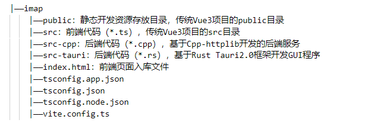

# imap

一个由“Rust + Tauri 2.0”、“yhirose/cpp-httplib”库提供后端静态资源服务和接口服务，前端基于Cesium和Vue3，以Tauri或操作系统默认的浏览器（当基于WebView的Tauri GUI不可用时）作为渲染UI界面的窗口的地图（GIS）类桌面应用软件。

- **特性**：
  - GUI模块使用Tauri2.0框架，或操作系统默认的浏览器（当基于WebView的Tauri GUI不可用时）
  - 后端使用C++库“[yhirose/cpp-httplib](https://github.com/yhirose/cpp-httplib)”，提供了一个轻量化的后端静态资源服务，以及接口服务；
  - 前端使用Vue3框架开发，默认由后端启动浏览器来作为显示整个程序UI界面的窗口

## 1. 目录结构说明

- 如下为imap项目工程的目录结构，及其说明。整体上，这只是在传统的Vue3项目上，新增了“src-cpp”目录和“CMakeLists.txt”文件。



## 2. 编译和打包

### 2.1 C++模块配置和编译

```sh
cd ./src-cpp
mkdir build
cd build
cmake ..
cmake --build . --config Release
```

### 2.2 前端安装依赖

```sh
pnpm install
```

### 2.3 纯前端打包

- 纯前端打包（开发环境）

```sh
pnpm dev
```

- 纯前端打包（正式环境）

```sh
pnpm build
```

### 2.4 Tauri程序打包

- 编译和热重载（开发环境）Tauri打包（开发环境）

```sh
pnpm tauri dev
```

- Tauri程序打包（正式环境）

```sh
pnpm tauri build
```
